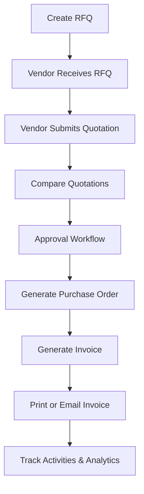

# 🚀 VendorBridge ERP

<div align="center">

### Procurement & Vendor Management ERP System

Streamlining procurement workflows with centralized vendor management, RFQs, approvals, invoices, and analytics.


</div>

---

# 📖 Overview

VendorBridge is a modern Procurement & Vendor Management ERP platform designed to simplify and digitize procurement operations for organizations.

The platform centralizes:

* Vendor Management
* RFQs (Request For Quotations)
* Vendor Quotations
* Approval Workflows
* Purchase Orders
* Invoice Generation
* Procurement Analytics

VendorBridge focuses on clean ERP architecture, reusable modules, secure workflows, and scalable system design.

---

# ✨ Features

## 🔐 Authentication System

* Secure Login & Signup
* Forgot Password
* Session Handling
* Validation
* Role-Based Authentication

---

## 📊 Dashboard

Track procurement activities in real-time.

### Includes

* Pending Approvals
* Active RFQs
* Recent Purchase Orders
* Invoice Tracking
* Analytics Cards
* Quick Actions

---

## 🏢 Vendor Management

Manage vendors efficiently.

### Features

* Vendor Registration
* Vendor Categories
* GST Details
* Contact Management
* Vendor Status Tracking
* Search & Filtering

---

## 📄 RFQ Management

Create and manage procurement requests.

### Features

* RFQ Creation
* Product/Service Details
* Quantity Management
* Attachments
* Vendor Assignment
* Deadline Management

---

## 💰 Vendor Quotations

Allow vendors to respond digitally.

### Features

* Pricing Submission
* Delivery Timelines
* Notes & Comments
* Editable Quotations
* Submission Tracking

---

## ⚖️ Quotation Comparison

Compare vendor quotations intelligently.

### Features

* Side-by-Side Comparison
* Lowest Price Highlighting
* Vendor Ratings
* Timeline Comparison
* Sorting & Filtering

---

## ✅ Approval Workflow

Structured procurement approvals.

### Features

* Approve / Reject Actions
* Approval Remarks
* Timeline Tracking
* Status Updates
* Workflow Transitions

---

## 🧾 Purchase Orders & Invoices

Generate procurement documents automatically.

### Features

* Auto PO Generation
* Invoice Creation
* Tax Calculations
* PDF Export
* Print Support
* Email Invoice Sending

---

## 🔔 Notifications & Activity Logs

Stay updated with procurement events.

### Features

* RFQ Notifications
* Approval Alerts
* Invoice Updates
* Activity Timeline
* Audit Logs

---

## 📈 Reports & Analytics

Gain procurement insights.

### Features

* Vendor Performance Reports
* Spending Analytics
* Procurement Statistics
* Monthly Trends
* Exportable Reports

---

# 👥 User Roles

| Role                      | Responsibilities                                         |
| ------------------------- | -------------------------------------------------------- |
| 🧑‍💼 Procurement Officer | Create RFQs, compare quotations, generate POs & invoices |
| 🏢 Vendor                 | Submit quotations, track RFQs, view purchase orders      |
| 🧑‍⚖️ Manager / Approver  | Approve or reject procurement requests                   |
| 🛠️ Admin                 | Manage users, vendors, and analytics                     |

---

# 🔄 Workflow



---

# 🛠️ Tech Stack

## Frontend

* React / Next.js
* Tailwind CSS
* Material UI

## Backend

* Node.js + Express
* REST API Architecture

## Database

* PostgreSQL / MySQL

## Authentication

* JWT Authentication
* Role-Based Access Control

## Additional Services

* PDF Generation
* Email Service Integration
* Analytics Dashboard

---

# 📂 Project Structure

```bash
VendorBridge/
│
├── frontend/          # Frontend Application
├── backend/           # Backend APIs
├── database/          # Database Schemas & Migrations
├── docs/              # Documentation
├── assets/            # Images & Static Files
└── README.md
```

---

# 🚀 Installation

## Clone Repository

```bash
git clone https://github.com/yourusername/vendorbridge-erp.git
```

## Navigate to Project

```bash
cd vendorbridge-erp
```

## Install Dependencies

### Frontend

```bash
cd frontend
npm install
```

### Backend

```bash
cd backend
npm install
```

---

# ▶️ Run Project

## Start Frontend

```bash
npm run dev
```

## Start Backend

```bash
npm run start
```

---

# 🌟 Future Improvements

* 🤖 AI-Based Vendor Recommendation
* 📱 Mobile Application
* 📊 Predictive Procurement Analytics
* 🏢 Multi-Organization Support
* 💬 Real-Time Communication System
* 🔗 Third-Party ERP Integrations

---

# 📸 Mockup

Excalidraw Mockup:

https://app.excalidraw.com/l/65VNwvy7c4X/5ywnm0v3qhK

---

# 🎯 Hackathon Goal

VendorBridge demonstrates how modern ERP systems can digitize procurement workflows using scalable architecture, automation, analytics, and intuitive user experiences.

---

# 🤝 Contributing

Contributions are welcome!

```bash
Fork the repository
Create your feature branch
Commit your changes
Push to the branch
Open a Pull Request
```

---

# 📄 License

This project is licensed under the MIT License.

---

<div align="center">

## ❤️ VendorBridge ERP

Building smarter procurement systems for modern organizations.

</div>
